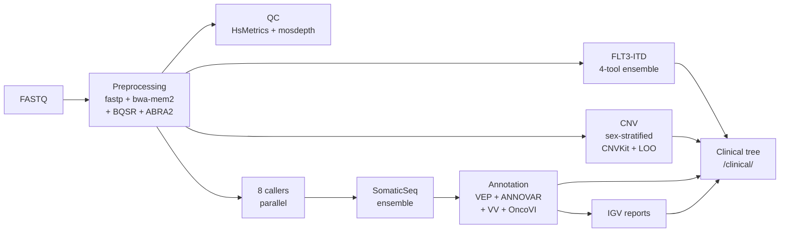

# nf-core-tspipe

**A clinical targeted-sequencing analysis pipeline for myeloid leukaemia panels.**

`nf-core-tspipe` takes paired-end FASTQ from a hybrid-capture or amplicon
leukaemia panel and produces a complete, sign-out-ready clinical deliverable per
sample: a curated and oncogenicity-scored variant table, an FLT3-ITD ensemble
call, sex-stratified copy-number results, and per-variant IGV pileup views. It is
built on Nextflow DSL2 following nf-core conventions, runs every step in a pinned
container, and parallelises across samples automatically. The pipeline is
developed and run clinically by the Patkar Lab, Department of Haematopathology,
ACTREC / Tata Memorial Centre.

It exists to replace an in-house Python orchestrator with a reproducible,
resumable, container-isolated workflow whose every tool version is recorded with
each run.

[](https://www.nextflow.io/)
[](https://nf-co.re/)
[](#system-requirements)
[](#system-requirements)
[](#status-and-known-limitations)

[**Install →**](docs/INSTALL.md) · [Usage](docs/usage.md) · [Output](docs/output.md) · [PoN build](docs/usage_pon.md) · [Clinical decisions](docs/clinical_decisions.md)

---

> **New here?** Start at **[`docs/INSTALL.md`](docs/INSTALL.md)** — the comprehensive
> fresh-server install guide. It covers prerequisites, reference data, site
> configuration, the VariantValidator REST stack setup, the container catalogue,
> samplesheet format, running, output, reproducibility, and troubleshooting in
> one place.

## Overview

Per sample, the pipeline takes paired-end FASTQ through preprocessing,
parallel variant calling across eight callers, ensemble consensus, an
independent FLT3-ITD pipeline, sex-stratified CNV calling, multi-source
annotation, and final assembly of a clinical deliverable tree.



**Stages**, in detail:

1. **Preprocessing** — fastp adapter trim → bwa-mem2 alignment → Picard MarkDuplicates → GATK4 BQSR → ABRA2 indel realignment
2. **QC** — Picard HsMetrics, mosdepth per-exon coverage, per-sample dashboard
3. **Variant calling** — eight callers in parallel (Mutect2, VarDict, VarScan, Strelka2, FreeBayes, Platypus, Pindel, DeepSomatic) plus U2AF1 paralog-rescue
4. **SomaticSeq ensemble** — 8-caller consensus
5. **FLT3-ITD ensemble** — FLT3_ITD_EXT, Pindel-region, filt3r, getITD → consensus TSV
6. **CNV calling** — CNVKit with sex-stratified panel-of-normals, z-score, plots, leave-one-out concordance, annotated clinical TSV
7. **Annotation** — VEP + ANNOVAR → variant filter (curated blacklist) → VariantValidator HGVS verification → OncoVI oncogenicity scoring
8. **IGV reports** — per-sample HTML pileup viewer for case review
9. **Organise output** — assembles `<sample>/clinical/` for clinical sign-out

Two entry workflows live in `main.nf`: **`TSPIPE`** (the per-sample
analysis above) and **`BUILD_PON`** (one-off panel-of-normals
construction; see [`docs/usage_pon.md`](docs/usage_pon.md)).

## Tools and components

Every step runs in a pinned container or conda environment; the exact image and
version for a given run is recorded in `pipeline_info/`. Versions below reflect
the pinned defaults in `modules/` and `conf/`.

### Preprocessing and QC

| Tool | Role in this pipeline | Version | Source |
|------|----------------------|---------|--------|
| **fastp** | Adapter trimming and read QC | 0.23.4 | `quay.io/biocontainers/fastp` |
| **bwa-mem2** | Short-read alignment to masked hg38 | (env) | conda / site env |
| **Picard** (via GATK4) | MarkDuplicates; HsMetrics capture QC | 4.5.0.0 | `broadinstitute/gatk` |
| **GATK4** | Base Quality Score Recalibration (BQSR) | 4.5.0.0 | `broadinstitute/gatk` |
| **ABRA2** | Local indel realignment around targets | (jar) | site install |
| **mosdepth** | Per-exon depth of coverage (incl. duplicates) | 0.3.10 | `quay.io/biocontainers/mosdepth` |
| **MultiQC** | Aggregate run QC report | 1.25 | `quay.io/biocontainers/multiqc` |
| **samtools / bcftools** | BAM/VCF manipulation throughout | 1.18 / 1.20 | `quay.io/biocontainers/*` |

### Variant calling and ensemble

| Tool | Role in this pipeline | Version | Source |
|------|----------------------|---------|--------|
| **Mutect2** (GATK4) | Somatic SNV/indel caller | 4.5.0.0 | `broadinstitute/gatk` |
| **VarDict** | Somatic SNV/indel caller | java (bioconda) | conda |
| **VarScan** | Somatic SNV/indel caller | via SomaticSeq | `lethalfang/somaticseq` 3.7.4 |
| **Strelka2** | Somatic SNV/indel caller | via SomaticSeq | `lethalfang/somaticseq` 3.7.4 |
| **FreeBayes** | Haplotype-based caller | via SomaticSeq | `lethalfang/somaticseq` 3.7.4 |
| **Platypus** | Local-assembly caller | via SomaticSeq | `lethalfang/somaticseq` 3.7.4 |
| **Pindel** | Indel / structural caller | via SomaticSeq | `lethalfang/somaticseq` 3.7.4 |
| **DeepSomatic** | Deep-learning somatic caller | 1.10.0 | `google/deepsomatic` |
| **U2AF1 rescue** | Pileup-based rescue of U2AF1 S34F (chr21 paralog MQ=0 artifact) | pysam 0.22.0 | conda |
| **SomaticSeq** | 8-caller ensemble consensus | 3.7.4 | `lethalfang/somaticseq` |

### FLT3-ITD ensemble

| Tool | Role in this pipeline | Version | Source |
|------|----------------------|---------|--------|
| **FLT3_ITD_EXT** | Primary FLT3-ITD detector | v0.2 (local) / v1.1 | `local/flt3_itd_ext` / `zhkddocker/flt3_itd_ext` |
| **filt3r** | k-mer FLT3-ITD detector | v0.1 | `local/filt3r` |
| **getITD** | Read-based FLT3-ITD detector | v0.1 | `local/getitd` |
| **Pindel (FLT3 region)** | Targeted indel detection over FLT3 | via SomaticSeq | `lethalfang/somaticseq` 3.7.4 |

The four are merged into a consensus FLT3-ITD TSV.

### Copy-number

| Tool | Role in this pipeline | Version | Source |
|------|----------------------|---------|--------|
| **CNVKit** | Copy-number calling with sex-stratified panel-of-normals, z-score, leave-one-out concordance, scatter plots | 0.9.10 | `quay.io/biocontainers/cnvkit` |
| **matplotlib / pandas / numpy** | CNV plotting and tabular processing | 3.8.2 / 2.1.4 / 1.26 | conda / biocontainers |

### Annotation and reporting

| Tool | Role in this pipeline | Version | Source |
|------|----------------------|---------|--------|
| **Ensembl VEP** | Transcript consequence annotation (MANE Select, severity-based CSQ selection) | 105 | conda env (`vep`) |
| **ANNOVAR** | refGene / COSMIC / gnomAD / ClinVar / dbSNP annotation | site install | params: `annovar_script` / `annovar_db` |
| **VariantValidator** | HGVS verification and exon assignment (REST service) | dockerised REST | `rest_variantValidator` compose stack |
| **OncoVI** | Oncogenicity scoring (AMP/ASCO/CAP-aligned) | bundled in `bin/` | conda |
| **igv-reports** | Per-variant IGV pileup HTML for case review | 1.12.0 | `quay.io/biocontainers/igv-reports` |
| **Dashboard builder** | Per-sample and cohort HTML dashboard, variant triage, CNV galleries | bundled in `bin/` | conda |

> Variant callers without a dedicated biocontainer (VarScan, Strelka2, FreeBayes,
> Platypus, Pindel) execute inside the SomaticSeq 3.7.4 image, which bundles them.
> VEP, ANNOVAR, and OncoVI run from site-managed environments referenced by
> pipeline parameters rather than a single tagged container; see
> [`docs/INSTALL.md#container-catalogue`](docs/INSTALL.md#container-catalogue) for
> the authoritative per-run catalogue.

## Quick start

> Reference: a comprehensive walkthrough of every step below is in [`docs/INSTALL.md`](docs/INSTALL.md).

```bash
# 1. Clone
git clone git@github.com:patkarlab/nf-core-tspipe.git
cd nf-core-tspipe

# 2. Copy the gandalf site config as a template, then edit it for your server
cp conf/gandalf.config conf/mysite.config
$EDITOR conf/mysite.config

# 3. Register the new profile in nextflow.config (add a mysite { ... } block)

# 4. Bring up the VariantValidator REST stack (required for the annotation step)
cd /path/to/rest_variantValidator && docker compose up -d

# 5. Build a samplesheet from your FASTQ directory
tools/make_samplesheet.sh /path/to/fastq_dir --output /tmp/today.csv

# 6. Run via the launch wrapper (recommended)
SAMPLESHEET=/tmp/today.csv \
    OUTDIR=/data/nfcore_runs/$(date +%Y%m%d_%H%M%S) \
    PROFILE=mysite,singularity \
    ./launch_tspipe.sh
```

The launch wrapper performs a VariantValidator (VV) health preflight
before invoking Nextflow. If VV is unreachable on the initial probe,
the wrapper attempts one cycle of auto-recovery (starts gunicorn
inside the REST container, waits for worker warm-up, re-probes) and
only launches Nextflow once VV returns `HTTP 200`. If preflight
fails, the wrapper exits with code 10 and no Nextflow tasks are
scheduled. See [`docs/sops/vv_troubleshooting.md`](docs/sops/vv_troubleshooting.md) for the manual SOP this wrapper automates.

Each sample produces a clinical deliverable tree at `<outdir>/<sample>/clinical/` containing the final BAM, clinical
variant TSV, FLT3-ITD consensus, CNV plots, IGV pileup HTML, and
per-sample dashboard.

**Direct Nextflow invocation (bypasses VV preflight)**

```bash
nextflow run . \
    --input /tmp/today.csv \
    --outdir /data/nfcore_runs/$(date +%Y%m%d_%H%M%S) \
    -profile mysite,singularity \
    -resume
```

This bypasses the VV preflight check. If VV is unreachable when the
annotation step runs, the pipeline will fail on the first `VARIANT_VALIDATOR` task. See [`docs/sops/vv_troubleshooting.md`](docs/sops/vv_troubleshooting.md) for the recovery procedure.

## Documentation

| Guide | When to read |
|-------|--------------|
| **[`docs/INSTALL.md`](docs/INSTALL.md)** | **Start here.** Comprehensive install reference for fresh-server deployments. |
| [`docs/usage.md`](docs/usage.md) | Parameter reference and day-to-day operation. |
| [`docs/sops/vv_troubleshooting.md`](docs/sops/vv_troubleshooting.md) | Troubleshooting the VariantValidator Docker stack when annotation fails. |
| [`docs/output.md`](docs/output.md) | Output directory layout in detail. |
| [`docs/usage_pon.md`](docs/usage_pon.md) | Building the CNV panel-of-normals (`BUILD_PON` workflow). |
| [`docs/clinical_decisions.md`](docs/clinical_decisions.md) | Intentional differences from the upstream Python pipeline. |
| [`docs/deployment.md`](docs/deployment.md) | Move-from-gandalf checklist (rsync-flavoured, complements INSTALL.md). |
| [`docs/testing.md`](docs/testing.md) | Phased smoke-test plan. |

## System requirements

|  | Minimum (16-sample run) | Tested baseline (gandalf) |
|--|-------------------------|---------------------------|
| **CPU** | 32 cores | 192 cores |
| **RAM** | 128 GB | 1.5 TB |
| **Operating system** | RHEL-family 9.x | Rocky Linux 9.6 |
| **Nextflow** | 25.10.4 | 25.10.4 |
| **Singularity / Apptainer** | 4.x (3.8+ minimum) | singularity-ce 4.3.2 |
| **Docker** | 20.10+ | 28.3.3 |
| **Docker Compose** | v2.x (plugin) | v2.39.1 |
| **Python 3** | 3.10+ (conda env) | 3.13.11 host / 3.10.14 env |

Both Singularity and Docker are required on the same host: Singularity
launches per-process containers, Docker hosts the VariantValidator REST
stack. See [`docs/INSTALL.md#prerequisites`](docs/INSTALL.md#prerequisites) for the full list, including network endpoints for air-gapped sites.

## Status and known limitations

The pipeline is in active clinical validation. The most recent
multi-sample run (16 samples, 2 h 19 min wall time, 2026-05-19)
produced complete clinical deliverables for all samples.

**Two known limitations**

- **FLT3_ITD_EXT failure on FLT3-ITD-negative specimens.** The
upstream tool exits with `NO ITD CANDIDATE CLUSTERS GENERATED`,
which Nextflow records as a task failure; `FLT3_CONSENSUS` then
emits a header-only TSV. All other modules complete normally; for
affected samples, consult per-caller outputs in `work/`. Fix
planned (sentinel output on no-ITD).
- **`test` profile is broken.** References missing `assets/test/` fixtures. Use `<yoursite>,singularity -stub` with a real 1-sample
samplesheet for structural validation.

**Differences from the upstream Python pipeline**

The pipeline replaces an in-house Python orchestrator
(`run_sample_pipeline.py`). Material differences:

1. **No batch-driver script.** Nextflow channels parallelise across
samples automatically; just put more rows in the samplesheet.
2. **No `--skip-from N`.** `-resume` caches every successful process.
3. **No manual intermediate cleanup.** `publishDir` controls what
gets copied to the output tree; the rest stays in `work/`.
4. **Sex is declared in the samplesheet**, not inferred from CNV
coverage. Drives sex-stratified PoN selection.
5. **Masked hg38 used for all steps**, including variant calling. The
upstream pipeline used unmasked hg38 for some callers, which
silently lost U2AF1 calls due to paralog collapse. See
[`docs/clinical_decisions.md`](docs/clinical_decisions.md).
6. **FLT3-ITD ensemble extended to 4 callers** (Pindel region added
2026-05-19), upgrading the consensus confidence on real ITDs.

See [`docs/INSTALL.md#open-items`](docs/INSTALL.md#open-items) for
the full open-items list.

## Credits

Developed and maintained by the [**Patkar Lab**](https://molhemat.org/), Department of
Haematopathology, [ACTREC, Tata Memorial Centre](https://actrec.gov.in/),
Navi Mumbai.

The pipeline integrates many upstream tools. Per-run, each module's
container image and tool version is recorded in `pipeline_info/execution_report_*.html`. The full container catalogue
is documented in [`docs/INSTALL.md#container-catalogue`](docs/INSTALL.md#container-catalogue).

For Nextflow and nf-core conventions: [nf-co.re](https://nf-co.re/) · [nextflow.io](https://www.nextflow.io/).

## License

MIT. See [`LICENSE`](LICENSE) for the full text.

SPDX-License-Identifier: `MIT`
