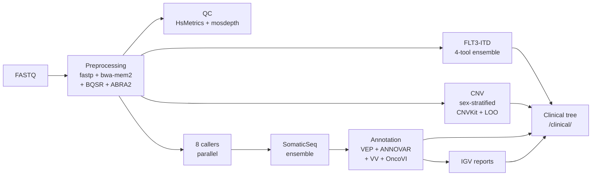

<h1 align="center">nf-core-tspipe</h1>

<p align="center">
  <strong>Targeted-sequencing analysis pipeline for myeloid leukaemia panels.</strong><br>
  Paired-end FASTQ &rarr; clinical variant TSV + FLT3-ITD ensemble + CNV report + IGV pileup HTML.
</p>

<p align="center">
  <a href="https://www.nextflow.io/"></a>
  <a href="https://nf-co.re/"></a>
  <a href="#system-requirements"></a>
  <a href="#system-requirements"></a>
  <a href="#status-and-known-limitations"></a>
</p>

<p align="center">
  <a href="docs/INSTALL.md"><strong>Install &rarr;</strong></a> &nbsp;&middot;&nbsp;
  <a href="docs/usage.md">Usage</a> &nbsp;&middot;&nbsp;
  <a href="docs/output.md">Output</a> &nbsp;&middot;&nbsp;
  <a href="docs/usage_pon.md">PoN build</a> &nbsp;&middot;&nbsp;
  <a href="docs/clinical_decisions.md">Clinical decisions</a>
</p>

---

> **New here?** Start at **[`docs/INSTALL.md`](docs/INSTALL.md)** — the comprehensive
> fresh-server install guide. It covers prerequisites, reference data, site
> configuration, the VariantValidator REST stack setup, the container catalogue,
> samplesheet format, running, output, reproducibility, and troubleshooting in
> one place.

## Overview

Per sample, the pipeline takes paired-end FASTQ through preprocessing,
parallel variant calling across eight callers, ensemble consensus, an
independent FLT3-ITD pipeline, sex-stratified CNV calling, multi-source
annotation, and final assembly of a clinical deliverable tree.



**Stages**, in detail:

1. **Preprocessing** &mdash; fastp adapter trim &rarr; bwa-mem2 alignment &rarr; Picard MarkDuplicates &rarr; GATK4 BQSR &rarr; ABRA2 indel realignment
2. **QC** &mdash; Picard HsMetrics, mosdepth per-exon coverage, per-sample dashboard
3. **Variant calling** &mdash; eight callers in parallel (Mutect2, VarDict, VarScan, Strelka2, FreeBayes, Platypus, Pindel, DeepSomatic) plus U2AF1 paralog-rescue
4. **SomaticSeq ensemble** &mdash; 8-caller consensus
5. **FLT3-ITD ensemble** &mdash; FLT3_ITD_EXT, Pindel-region, filt3r, getITD &rarr; consensus TSV
6. **CNV calling** &mdash; CNVKit with sex-stratified panel-of-normals, z-score, plots, leave-one-out concordance, annotated clinical TSV
7. **Annotation** &mdash; VEP + ANNOVAR &rarr; variant filter (curated blacklist) &rarr; VariantValidator HGVS verification &rarr; OncoVI oncogenicity scoring
8. **IGV reports** &mdash; per-sample HTML pileup viewer for case review
9. **Organise output** &mdash; assembles `<sample>/clinical/` for clinical sign-out

Two entry workflows live in `main.nf`: **`TSPIPE`** (the per-sample
analysis above) and **`BUILD_PON`** (one-off panel-of-normals
construction; see [`docs/usage_pon.md`](docs/usage_pon.md)).

## Quick start

> Reference: a comprehensive walkthrough of every step below is in
> [`docs/INSTALL.md`](docs/INSTALL.md).

```bash
# 1. Clone
git clone git@github.com:patkarlab/nf-core-tspipe.git
cd nf-core-tspipe

# 2. Copy the gandalf site config as a template, then edit it for your server
cp conf/gandalf.config conf/mysite.config
$EDITOR conf/mysite.config

# 3. Register the new profile in nextflow.config (add a mysite { ... } block)

# 4. Bring up the VariantValidator REST stack (required for the annotation step)
cd /path/to/rest_variantValidator && docker compose up -d

# 5. Build a samplesheet from your FASTQ directory
tools/make_samplesheet.sh /path/to/fastq_dir --output /tmp/today.csv

# 6. Run
nextflow run . \
    --input /tmp/today.csv \
    --outdir /data/nfcore_runs/$(date +%Y%m%d_%H%M%S) \
    -profile mysite,singularity \
    -resume
```

Each sample produces a clinical deliverable tree at
`<outdir>/<sample>/clinical/` containing the final BAM, clinical
variant TSV, FLT3-ITD consensus, CNV plots, IGV pileup HTML, and
per-sample dashboard.

## Documentation

| Guide | When to read |
|---|---|
| **[`docs/INSTALL.md`](docs/INSTALL.md)** | **Start here.** Comprehensive install reference for fresh-server deployments. |
| [`docs/usage.md`](docs/usage.md) | Parameter reference and day-to-day operation. |
| [`docs/output.md`](docs/output.md) | Output directory layout in detail. |
| [`docs/usage_pon.md`](docs/usage_pon.md) | Building the CNV panel-of-normals (`BUILD_PON` workflow). |
| [`docs/clinical_decisions.md`](docs/clinical_decisions.md) | Intentional differences from the upstream Python pipeline (U2AF1 paralog masking, VarScan threshold, DeepSomatic flags). |
| [`docs/deployment.md`](docs/deployment.md) | Move-from-gandalf checklist (rsync-flavoured, complements INSTALL.md). |
| [`docs/testing.md`](docs/testing.md) | Phased smoke-test plan. |

## System requirements

|   | Minimum (16-sample run) | Tested baseline (gandalf) |
|---|---|---|
| **CPU** | 32 cores | 192 cores |
| **RAM** | 128 GB | 1.5 TB |
| **Operating system** | RHEL-family 9.x | Rocky Linux 9.6 |
| **Nextflow** | 25.10.4 | 25.10.4 |
| **Singularity / Apptainer** | 4.x (3.8+ minimum) | singularity-ce 4.3.2 |
| **Docker** | 20.10+ | 28.3.3 |
| **Docker Compose** | v2.x (plugin) | v2.39.1 |
| **Python 3** | 3.10+ (conda env) | 3.13.11 host / 3.10.14 env |

Both Singularity and Docker are required on the same host: Singularity
launches per-process containers, Docker hosts the VariantValidator REST
stack. See [`docs/INSTALL.md#prerequisites`](docs/INSTALL.md#prerequisites)
for the full list, including network endpoints for air-gapped sites.

## Status and known limitations

The pipeline is in active clinical validation. The most recent
multi-sample run (16 samples, 2 h 19 min wall time, 2026-05-19)
produced complete clinical deliverables for all samples.

<details>
<summary><strong>Two known limitations</strong> (click to expand)</summary>

- **FLT3_ITD_EXT failure on FLT3-ITD-negative specimens.** The
  upstream tool exits with `NO ITD CANDIDATE CLUSTERS GENERATED`,
  which Nextflow records as a task failure; `FLT3_CONSENSUS` then
  emits a header-only TSV. All other modules complete normally; for
  affected samples, consult per-caller outputs in `work/`. Fix
  planned (sentinel output on no-ITD).
- **`test` profile is broken.** References missing `assets/test/`
  fixtures. Use `<yoursite>,singularity -stub` with a real 1-sample
  samplesheet for structural validation.

</details>

<details>
<summary><strong>Differences from the upstream Python pipeline</strong> (click to expand)</summary>

The pipeline replaces an in-house Python orchestrator
(`run_sample_pipeline.py`). Material differences:

1. **No batch-driver script.** Nextflow channels parallelise across
   samples automatically; just put more rows in the samplesheet.
2. **No `--skip-from N`.** `-resume` caches every successful process.
3. **No manual intermediate cleanup.** `publishDir` controls what
   gets copied to the output tree; the rest stays in `work/`.
4. **Sex is declared in the samplesheet**, not inferred from CNV
   coverage. Drives sex-stratified PoN selection.
5. **Masked hg38 used for all steps**, including variant calling. The
   upstream pipeline used unmasked hg38 for some callers, which
   silently lost U2AF1 calls due to paralog collapse. See
   [`docs/clinical_decisions.md`](docs/clinical_decisions.md).
6. **FLT3-ITD ensemble extended to 4 callers** (Pindel region added
   2026-05-19), upgrading the consensus confidence on real ITDs.

</details>

See [`docs/INSTALL.md#open-items`](docs/INSTALL.md#open-items) for
the full open-items list.

## Credits

Developed and maintained by the **Patkar Lab**, Department of
Haematopathology, [ACTREC, Tata Memorial Centre](https://actrec.gov.in/),
Navi Mumbai.

The pipeline integrates many upstream tools. Per-run, each module's
container image and tool version is recorded in
`pipeline_info/execution_report_*.html`. The full container catalogue
is documented in
[`docs/INSTALL.md#container-catalogue`](docs/INSTALL.md#container-catalogue).

For Nextflow and nf-core conventions: [nf-co.re](https://nf-co.re/) &middot;
[nextflow.io](https://www.nextflow.io/).

## License

MIT. See [`LICENSE`](LICENSE) for the full text.

SPDX-License-Identifier: `MIT`

