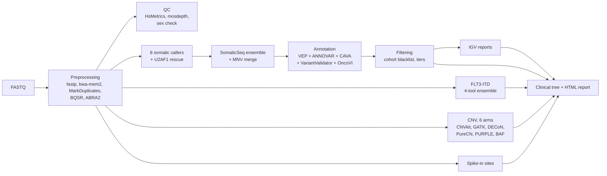

# nf-core-tspipe

**A clinical targeted-sequencing pipeline for myeloid leukaemia panels.**

`nf-core-tspipe` takes paired-end FASTQ from a hybrid-capture panel and produces a
sign-out-ready clinical deliverable per sample: an annotated, blacklist-filtered and
oncogenicity-scored variant table with MANE-Select nomenclature, an FLT3-ITD ensemble
call, a multi-caller sex-stratified copy-number result with per-arm allelic-imbalance
analysis, per-variant IGV pileup views, and an interactive HTML report for review. It is
built on Nextflow DSL2 following nf-core conventions, runs every process in a pinned
container, and parallelises across samples automatically.

Developed and run clinically by the Patkar Lab, Department of Haematopathology,
ACTREC / Tata Memorial Centre, Navi Mumbai.

[](https://www.nextflow.io/)
[](https://nf-co.re/)
[](#system-requirements)
[](docs/RELEASE_NOTES.md)
[](docs/sops/SOP-TSPIPE-001.md)

---

> **This README is orientation only.** Installation, qualification, routine operation and
> change control are governed by the controlled document
> **[`docs/sops/SOP-TSPIPE-001`](docs/sops/SOP-TSPIPE-001.md)**
> ([PDF](docs/sops/SOP-TSPIPE-001.pdf)). Where the two disagree, the SOP is correct.
> Release contents, validation evidence and known findings are in
> [`docs/RELEASE_NOTES.md`](docs/RELEASE_NOTES.md).

## Release status

`v1.0.0` — clinical freeze, 2026-09-10 on the development host; deployed and accepted on the
clinical HPC on 2026-09-11 after a byte-level golden regression
([`docs/audit/2026-09-11/run8_gandalf_vs_clinical23_v2.md`](docs/audit/2026-09-11/run8_gandalf_vs_clinical23_v2.md)).
Feature development for v1.1 continues on `main`; the tag is what is used for reporting.

Every process runs in a container. No process depends on a conda environment, a
`beforeScript` PATH export, or a tool installed on the host. `conf/containers.config`
assigns the image and the per-process `PATH`; site profiles carry only paths, executor
settings and resources.

## Pipeline stages


```mermaid
flowchart LR
    A[FASTQ] --> B[Preprocessing<br/>fastp, bwa-mem2, MarkDuplicates,<br/>BQSR, ABRA2]
    B --> C[QC<br/>HsMetrics, mosdepth,<br/>sex check]
    B --> D[8 somatic callers<br/>+ U2AF1 rescue]
    D --> E[SomaticSeq ensemble<br/>+ MNV merge]
    B --> F[FLT3-ITD<br/>4-tool ensemble]
    B --> G[CNV, 6 arms<br/>CNVkit, GATK, DECoN,<br/>PureCN, PURPLE, BAF]
    E --> H[Annotation<br/>VEP + ANNOVAR + CAVA<br/>+ VariantValidator + OncoVI]
    H --> I[Filtering<br/>cohort blacklist, tiers]
    I --> J[IGV reports]
    B --> K[Spike-in sites]
    I --> L[Clinical tree + HTML report]
    F --> L
    G --> L
    J --> L
    K --> L
```

1. **Preprocessing** — fastp adapter trimming, bwa-mem2 alignment to masked GRCh38
   (ALT-aware), Picard MarkDuplicates, GATK4 BQSR, ABRA2 indel realignment, BAM integrity
   check.
2. **QC** — Picard HsMetrics, mosdepth per-exon coverage (duplicates included, per clinical
   convention), genotype-based sex check from chrX heterozygosity, and a coverage verdict
   (`PASS` / `PASS WITH LIMITATIONS` / `REVIEW`) using a 100× floor, a 200× reportability
   tier and a known-low-capture exon asset.
3. **Somatic variant calling** — Mutect2, VarDict, VarScan, Strelka2, FreeBayes, Platypus,
   Pindel and DeepSomatic in parallel, plus a pileup-based rescue of the U2AF1 S34/Q157
   region that paralog collapse otherwise loses.
4. **Ensemble and MNV merge** — SomaticSeq consensus, then reconstruction of multi-nucleotide
   variants (gap ≤ 2 bp) that the callers decomposed, added alongside their tagged
   components.
5. **FLT3-ITD ensemble** — FLT3_ITD_EXT, filt3r, getITD and Pindel over the FLT3 region,
   merged into a consensus TSV with `PASS_HIGH` / `PASS_LOW` / `REVIEW_REQUIRED` tiers.
6. **Copy number** — six independent arms, each sex-stratified against the panel of normals:
   CNVkit, GATK ModelSegments, DECoN (exon level), PureCN, PURPLE (hmftools AMBER/COBALT,
   tumour-only targeted) and a per-chromosome-arm B-allele-frequency detector for cnLOH and
   allelic imbalance. Results are reconciled into a consensus gene table with tier
   assignment, cytoband, ClinGen haploinsufficiency/triplosensitivity and driver-role
   columns.
7. **Annotation** — VEP (MANE-Select-first consequence selection) and ANNOVAR, merged on a
   representation-safe key, plus CAVA for clinical HGVS nomenclature, VariantValidator for
   HGVS verification and exon assignment, and OncoVI for oncogenicity scoring. The dashboard
   adds GeneBe, MobiDetails, CancerVar and, optionally, OncoKB.
8. **Filtering** — consequence and depth rules, common-polymorphism removal, ClinVar
   benign demotion, curated SNV blacklist and a cohort-derived variant panel-of-normals
   blacklist built from the 48 capture normals. Coding synonymous variants are retained and
   tagged rather than dropped.
9. **Reporting** — per-variant IGV pileup HTML, per-sample tabbed report (Overview, QC,
   Clinical variants, All filtered, FLT3, CNV with consensus/BAF/genome/chromosome/reconCNV
   sub-tabs, Spike-in, Blacklisted, IGV, Reporting, Files), a cohort index, a per-sample
   review bundle and a per-run bundle.
10. **Organise output** — assembles `<outdir>/<sample>/clinical/` and prunes scratch.

Three workflow entry points live in `main.nf`:

| Entry | Purpose |
|-------|---------|
| `TSPIPE` (default) | Per-sample clinical analysis. |
| `BUILD_PON` | CNVkit-only panel-of-normals build, retained from the earlier MYOPOOL panels ([`docs/usage_pon.md`](docs/usage_pon.md)). |
| `BUILD_PON_TWIST` | Full PoN build for the Twist panel: CNVkit, GATK read-count PoN, DECoN pools, PureCN normal DB, BAF background and het catalog. |

## Panel

The clinical panel is **Twist Myeloid TE-99430185** (`params.panel = 'twist_myeloid'`),
selected by loading the panel overlay alongside the site profile:

```
-c conf/twist_apply.config
```

The overlay is complete — panel BED, exonwise BED, CNV resources, detector thresholds and
publication rules — so no per-panel CLI flags are needed. Panel assets live under
`assets/twist_myeloid/`.

## Execution model

Two kinds of image, both pinned and checksummed in
[`docs/release/image_checksums.md5`](docs/release/image_checksums.md5):

**`local/tspipe-host:v1.1`** — built from the validated development-host environments with
`conda-pack` (`containers/tspipe-host/`), carrying seven environments under `/opt/envs/`
(`targeted-seq`, `vep`, `py2`, `purecn`, `decon`, `hmftools`, `reconCNV`) and Strelka2,
ANNOVAR, OncoVI and the VarDict helpers under `/opt/`. It runs:

| Step | Tool |
|------|------|
| Alignment, realignment | bwa-mem2, ABRA2 |
| Callers | VarDict, VarScan, FreeBayes, Platypus, Strelka2, Pindel |
| Annotation | VEP 105, ANNOVAR, VariantValidator client, OncoVI |
| CNV | CNVkit 0.9.12, GATK 4.6.2.0 (CNV steps), DECoN, PureCN, hmftools, reconCNV, BAF detector, consensus |
| Reporting | dashboard builder, report and run bundles |

The CNV tool versions matter: the panel of normals was built with cnvkit 0.9.12 and
GATK 4.6.2.0, and a PoN must be applied with the version that built it.

**Public and local task images** — for the steps that already ran in containers:

| Image | Steps |
|-------|-------|
| `broadinstitute/gatk:4.5.0.0` | Mutect2, MarkDuplicates, BQSR, HsMetrics, sex check, MNV merge, spike-in sites, chromosome pages, exon plots, organise output |
| `lethalfang/somaticseq:3.7.4` | SomaticSeq ensemble |
| `google/deepsomatic:1.10.0` | DeepSomatic |
| `local/cava:v2.0.15` | CAVA |
| `local/filt3r:v0.1`, `local/flt3_itd_ext:v0.2`, `local/getitd:v0.1` | FLT3-ITD ensemble |
| `quay.io/biocontainers/*` | fastp 0.23.4, samtools 1.18, bcftools 1.20, mosdepth 0.3.10, igv-reports 1.12.0, cnvkit 0.9.10 |

Singularity/Apptainer conversion is not byte-reproducible, so the `.img` files are release
artefacts in their own right: they are transferred and checksum-verified, never rebuilt at a
new site. The image bundles ANNOVAR, VEP, Strelka2, OncoVI and hmftools, so it must never be
pushed to a public registry. Backup and restore of the image set is SOP section 14.

## Quick start

On an installed and qualified host (see the SOP for anything else):

```bash
cd ~/pipelines/nf-core-tspipe-v1.0.0
RUN=myrun_20260915

setsid nextflow run . \
    --input myrun.csv \
    --outdir /scratch/<area>/${RUN} \
    -w /scratch/<area>/work_${RUN} \
    -profile <site>,singularity \
    -c conf/twist_apply.config \
    -params-file params_<site>.yaml \
    -ansi-log false \
    > /tmp/${RUN}.log 2>&1 < /dev/null & disown
```

Every argument is required on the clinical HPC: `-c conf/twist_apply.config` selects the
Twist panel, `-params-file` redirects the site's reference paths, `setsid … & disown`
survives logout, `-ansi-log false` gives a readable log. Add `-resume` to continue an
interrupted run from the same work directory.

The run is complete when the log contains
`Cleanup complete. Final per-sample layout: <outdir>/<sample>/clinical/`.

**Samplesheet** — `sample,fastq_1,fastq_2,sex` (`male` / `female` / `unknown`), absolute
paths, validated by a preflight gate before any task is scheduled. `tools/make_samplesheet.sh`
builds one from a FASTQ directory; `assets/samplesheet_example.csv` is the reference. The
declared sex drives PoN selection and is checked against the genotype-based sex call, which
raises `REVIEW` on a mismatch but never stops the run.

**Launch wrapper** — `launch_tspipe.sh` adds a VariantValidator preflight (and one cycle of
auto-recovery for the local Docker REST stack) before invoking Nextflow, exiting 10 if VV is
unreachable. It is the supported entry point where the local VV stack is in use. Sites on the
public VariantValidator API (the default, `params.vv_url`) can invoke Nextflow directly; set
`VV_URL` to the public endpoint if using the wrapper.

**New host** — SOP section 7 (installation from nothing) and section 12 (porting), with
`tools/make_sandboxes.sh` for the image sandboxes and `tools/verify_install.sh` for
installation qualification against `docs/release/reference_manifest.tsv`.

## Output

```
<outdir>/
├── cohort_index.html                 cohort dashboard
├── assets/                           vendored JS/CSS (no CDN)
├── <run>_reports.zip                 all per-sample reports
├── pipeline_info/                    execution report, timeline, trace, DAG
└── <sample>/
    ├── <sample>_report.zip           self-contained review bundle
    └── clinical/
        ├── <sample>.final.bam(.bai)  analysis-ready alignment
        ├── <sample>.somaticseq.clinical.final.tsv    reportable variants
        ├── <sample>.somaticseq.filtered.tsv          all filtered variants with reasons
        ├── <sample>_report.html      tabbed review report
        ├── <sample>_igv_report.html  per-variant pileups
        ├── <sample>_flt3_consensus.tsv   FLT3-ITD ensemble
        ├── <sample>.spikein_snps.tsv     spike-in / germline risk sites
        ├── cnv/                      consensus, baf, purple, decon, chrom_pages,
        │                             exon_plots, reconcnv, sex_check
        └── QC files                  HsMetrics, per-exon coverage, fastp
```

Full layout: [`docs/output.md`](docs/output.md).

## Documentation

| Document | When to read |
|----------|--------------|
| **[`docs/sops/SOP-TSPIPE-001.md`](docs/sops/SOP-TSPIPE-001.md)** | **Start here.** Controlled SOP: dependencies, installation, IQ/OQ, operation, troubleshooting, change control, porting, backup and restore. Annex A is the clinical HPC installation record. |
| [`docs/RELEASE_NOTES.md`](docs/RELEASE_NOTES.md) | What v1.0.0 contains, validation evidence, known findings, what is deferred. |
| [`docs/usage.md`](docs/usage.md) | Parameter reference. |
| [`docs/output.md`](docs/output.md) | Output layout. |
| [`docs/clinical_decisions.md`](docs/clinical_decisions.md) | Intentional analytical choices and their rationale. |
| [`docs/dashboard.md`](docs/dashboard.md) | Dashboard builder, external annotators, credential setup. |
| [`docs/usage_pon.md`](docs/usage_pon.md) | Panel-of-normals builds. |
| [`docs/sops/`](docs/sops) | Per-component SOPs: variant filter, CNV consensus, BAF catalog, DECoN, PURPLE, sex check, spike-in tab, chromosome pages, MNV merge, QC page, VariantValidator troubleshooting. |
| [`docs/audit/`](docs/audit), [`docs/memos/`](docs/memos) | Dated development and validation records. |
| [`docs/INSTALL.md`](docs/INSTALL.md), [`docs/deployment.md`](docs/deployment.md), [`docs/testing.md`](docs/testing.md) | **Historical.** Written for the pre-containerisation layout (conda on host, local VV stack); superseded by the SOP. |

## Validation and reproducibility

- Eight-sample Twist validation cohort on the frozen image: 451 tasks, no failures,
  2 h 33 min.
- Image-to-image regression (`tools/compare_runs.py`): 1,233 files identical; every clinical
  table, consensus table, PURPLE table and BAF output identical
  ([`docs/audit/2026-09-11/run8_v1_vs_v11.md`](docs/audit/2026-09-11/run8_v1_vs_v11.md)).
- Cross-host golden regression, development host vs clinical HPC on the same image: clinical
  tables identical on all eight samples; BAM records byte-identical; the only text differences
  are timestamped logs
  ([`docs/audit/2026-09-11/run8_gandalf_vs_clinical23_v2.md`](docs/audit/2026-09-11/run8_gandalf_vs_clinical23_v2.md)).
- VEP output is byte-reproducible (`PERL_HASH_SEED=0`, `PERL_PERTURB_KEYS=0`).
- **The image, not the host, is the reference.** PURPLE's PCF segmentation depends on the C
  library: the same task gives identical output within an environment but a slightly different
  segment set between an el9 host and the Ubuntu 22.04 image, shifting copy numbers by about
  0.005 with purity and ploidy unchanged. A new site's regression therefore compares image run
  against image run.
- `tools/compare_runs.py` is the regression method: it pairs files by relative path, masks
  cosmetic differences (paths, dates, run names, hashes) and exits non-zero on a real
  difference.

## Known limitations

- **FLT3_ITD_EXT** does not write `final_FLT3_ITD.vcf`; its directory output is declared
  optional so the run proceeds, and the other three detectors carry the ensemble. Under
  investigation.
- **reconCNV** is a QC view: if it fails, the module warns and writes a placeholder HTML
  rather than failing the run.
- **The `test` profile is not usable** (missing `assets/test/` fixtures). Use
  `-profile <site>,singularity -stub` with a one-sample samplesheet for DAG validation.
- **17p allelic-imbalance sensitivity** is limited by SNP density: the BAF detector calls
  cnLOH from roughly f ≈ 0.15 and haplotype phasing (MoChA) was evaluated and parked because
  the panel's 17p SNP spacing makes phase between consecutive informative sites near random
  ([`docs/memos/memo18_mocha17p_feasibility.md`](docs/memos/memo18_mocha17p_feasibility.md)).
- **VariantValidator** runs against the public API with `maxForks 1` and a response cache; a
  transient outage at that endpoint retries but is a clinical-readiness dependency.
- Deferred to v1.1: re-run of the 48 normals through the current pipeline with a blacklist and
  BAF-background rebuild, female normals re-capture and female PoN, capture conformity gate,
  ClinVar refresh, asset reconciliation. See [`docs/RELEASE_NOTES.md`](docs/RELEASE_NOTES.md).

## Data handling and credentials

- **No patient data belongs in this repository.** Samplesheets, FASTQ, BAM, per-case variant
  tables and run outputs live on the analysis filesystems, not in git. Panel assets and
  cohort-derived resources (blacklists, PoN, BAF background) are aggregate and carry no
  sample identifiers.
- **Credentials are never committed.** The OncoKB token and any GeneBe key live in
  `~/.config/nf-core-tspipe/credentials.config` (mode 600), which `nextflow.config` includes
  when present. See [`docs/dashboard.md`](docs/dashboard.md).
- **Network endpoints used at run time**: VariantValidator, GeneBe, MobiDetails, CancerVar and
  (when enabled) OncoKB. Sites without egress from compute nodes must run the network-facing
  processes on the head node; the site profiles do this with `executor 'local'`.

## System requirements

|  | Minimum | Validated |
|--|---------|-----------|
| CPU | 16 cores | 192 cores (dev host) / 48-core PBS Pro nodes (clinical HPC) |
| RAM | 64 GB | 1.5 TB / 250 GB per node |
| Disk | ~25 GB work + ~3 GB output per sample | — |
| OS | RHEL-family 8/9 | Rocky Linux 9.6, RHEL 8.10 |
| Nextflow | 25.10.4 (pinned) | 25.10.4 |
| Apptainer / Singularity | 1.5.x / 4.x | apptainer 1.5.1, singularity-ce 4.3.2 |
| Docker | only to build the host image | 28.3.3 |

Docker is not required to run the pipeline. It is needed on the development host to build
`local/tspipe-host`, and only there.

## Repository layout

```
main.nf                 entry workflows (TSPIPE, BUILD_PON, BUILD_PON_TWIST)
workflows/              per-workflow orchestration
subworkflows/local/     preprocessing, variant calling, FLT3, CNV, annotation
modules/local/          80 process definitions, each with a stub block
bin/                    pipeline scripts (annotation, filter, CNV, dashboard builder)
conf/                   base, modules, containers, panel overlay, site profiles
assets/<panel>/         panel BEDs, PoN, blacklists, catalogs
containers/             image recipes (tspipe-host, cava, filt3r, getitd, flt3_itd_ext, mocha)
tools/                  helpers: samplesheets, install verification, run comparison, patches
docs/                   SOPs, release artefacts, usage, audit trail
```

## Versioning and change control

Releases are tagged and frozen; `docs/release/` holds the image checksums and the reference
manifest that define a release. Any change to a module, a `bin/` script, an asset or a
threshold is a change to a validated system and follows SOP section 11: record the reason,
apply on the development host, re-run the validation cohort, compare against the accepted run
with `tools/compare_runs.py`, and re-qualify the clinical host.

## Credits

[Patkar Lab](https://molhemat.org/), Department of Haematopathology,
[ACTREC, Tata Memorial Centre](https://actrec.gov.in/), Navi Mumbai.

The pipeline integrates many upstream tools; each run records the image and tool version for
every task in `pipeline_info/`. Please cite the underlying tools alongside this pipeline.

For Nextflow and nf-core conventions: [nf-co.re](https://nf-co.re/) ·
[nextflow.io](https://www.nextflow.io/).

## License

MIT. See [`LICENSE`](LICENSE).

SPDX-License-Identifier: `MIT`
